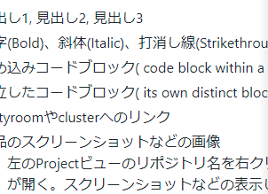

# portfolio
ポートフォリオページ

atomで追加

# 見出し１

## 見出し２

### 見出し３

## 書式
**太字** **bold**

*斜体* *Italic*

~~打消し線~~ ~~Strikethrough~~

## コードブロック
これは`code block within a line`です。

```cs
string a = "これはC#(cs)初期のブロック";
```

## リンク

[unityroom たなかゆう](https://unityroom.com/users/81feabmrtpxcuv0h5dlg)

## 画像




## 箇条書き

### 通常リスト

- 箇条書き
- 箇条書き２
- 箇条書き３

### 通し番号付きリスト

1. 通し番号１
1. 通し番号２
1. 通し番号３

### 途中から番号を始める

100. 好きな値から
100. 始められる


### 字下げ
- 箇条書き
  - 字下げ
    - 字下げ

## タスクリスト
- [ ] タスク１
- [ ] タスク２
- [x] タスク３

## 段落
1行だけの改行は
効果がない。
